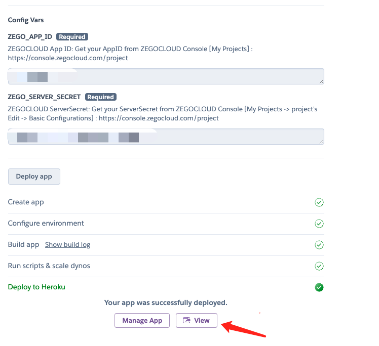

# NodeJS Server Example - ZEGOCLOUD Room List 

[](https://heroku.com/deploy?template=https://github.com/ZEGOCLOUD/room_list_server_nodejs)

This is an example of a server program for "querying the room list under your appid"

Notice

1. This function needs to contact us to activate it to use
2. Since this function has a QPS limit of 20/s, we have made a simple 500ms cache logic in the example

## Getting started

### Create ZEGOCLOUD project

Create project on [ZEGOCLOUD Console](https://console.zegocloud.com), then get the required info as shown below:

- Get your AppID from ZEGOCLOUD Console [My Projects](https://console.zegocloud.com/project)
- Get your ServerSecret from ZEGOCLOUD Console [My Projects -&gt; project&#39;s Edit -&gt; Basic Configurations](https://console.zegocloud.com/project)

### Deploy service

1. Click this deploy button at the top of this page to start deploy your service.


2. Pick your Heroku app-name and fill in the input box.
3. Fill in the appid and serverSecret of your zegocloud projectPress `Deploy App` button, wait for the depoly process completed
4. Once done you will get an url for your instance, try accessing `https://<heroku url>/describe_room_list` to check if it works.


After deplopyed successfully, you can get your server url by click this `view button`



After clicking, you will be redirected to `your-app-name.herokuapp.com`, you can test your api by appending `/describe_room_list` to that url.

you will get a json response


## ZEGOCLOUD room list protocol description

The following is the description of the zegocloud server interface, which is thid demo used

### Interface prototype

- Interface name: get room list
- Request method: GET
- Request path: /?Action=DescribeRoomList

### Query parameters

| Parameter name | Required | Description |
| ---------------- | -------- | --------------- |
| AppId | Required | |
| Signature | Required | |
| SignatureNonce | Required | |
| SignatureVersion | Required | |
| Timestamp | Required | |
| PageIndex | Not required | The page number of the query, default value: 1. The page number should not be greater than [Total/PageSize], otherwise it will not contain any room data. |
| PageSize | Optional | Number of rooms per page, default: 100. Value range [1,200]. |

### Response

| Parameter name | Type | Required | Remarks |
| ------------------------ | ------- | -------- | ----------------- |
| Code | number | Required |  |
| Message | string | Required |  |
| RequestId | string | Required |  |
| Data | object | Not required |  |
| ..└ TotalCount | integer | optional | total number of rooms |
| ..└ RoomList | array | Not required | Room list, sorted as: number of people from most to least |
| ....└ RoomId | string | Optional | RoomId |
| ....└ UserCount | integer | optional | number of users |

### Example

#### request

```bash
curl --location --request GET 'https://rtc-api.zego.im/?Action=DescribeRoomList&AppId=1111111111&Timestamp=1654767863&Signature=ttttttttttt&SignatureVersion=2.0&SignatureNonce=bbe594dbabdd3502&PageIndex=1&PageSize=200'
```

#### response

```json
{
     "Code": 0,
     "Data": {
         "TotalCount": 3,
         "RoomList": [
             {
                 "RoomId": "room2",
                 "UserCount": 3
             },
             {
                 "RoomId": "room1",
                 "UserCount": 2
             },
             {
                 "RoomId": "room3",
                 "UserCount": 1
             }
         ]
     },
     "Message": "success",
     "RequestId": "TestRequestId1653535713776559000"
}
```

## About us

https://www.zegocloud.com/

## License

The MIT License (MIT).
